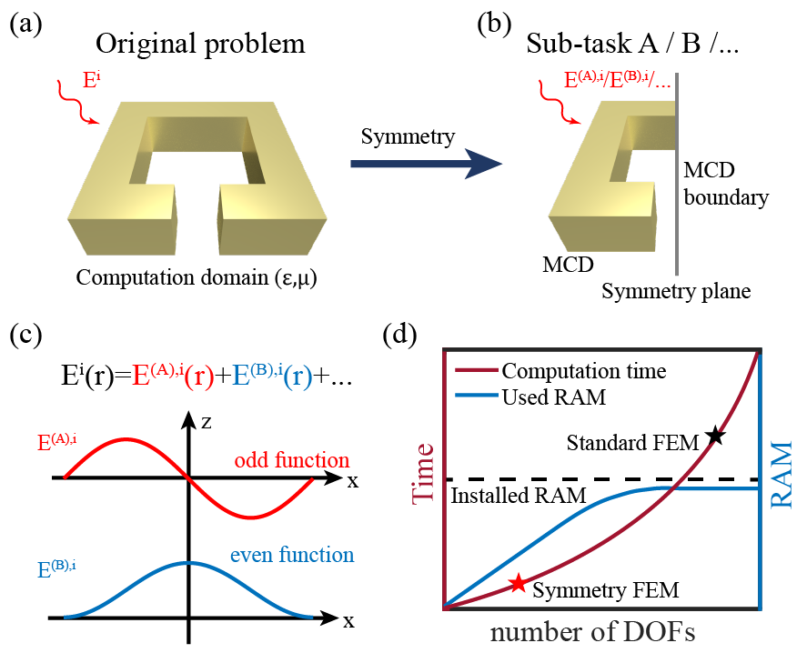
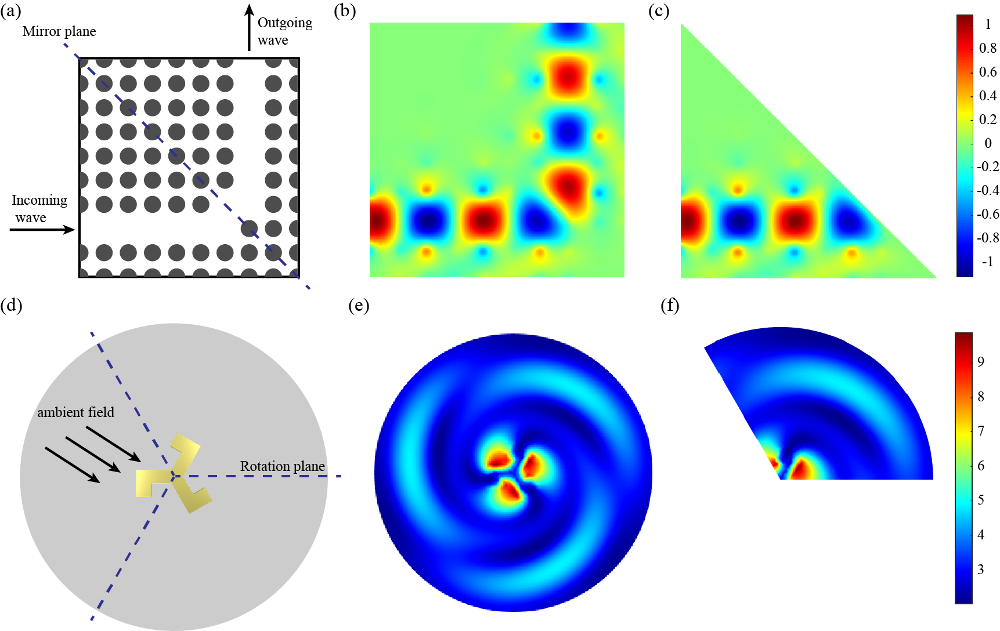

# symmetry-FEM-for-light-scattering-problem

## Overview
The Open-source MATLAB package Symmetry FEM is an optical finite element program used for scattering problems. Based on the symmetry in group theory, it can divide the original problem into several sub-tasks and truncate the computational domain. This program significantly enhances the computational efficiency for scattering problems. We provided examples of mirror symmetry and rotational symmetry, respectively.

## Usage
### Kernel function for matrix assembly
1. `kernel/AssemblyOfXXX_mirror.m`:Used for standard FEM matrix assembly and mirror symmetry FEM matrix assembly.
2. `kernel/AssemblyOfXXX_rotation.m`:Used for standard FEM matrix assembly and rotation symmetry FEM matrix assembly.

### Main function of FEM
1. `Main_StandardFEM_mirror_TM.m`:Main function of the standard FEM to compute the TM components of the electric field in mirror-symmetric photonic crystals.
2. `Main_SymmetryFEM_mirror_TM.m`:Main function of the symmetry FEM to compute the TM components of the electric field in mirror-symmetric photonic crystals.
3. `Main_StandardFEM_rotation_TE.m`:Main function of the standard FEM to compute the TE components of the electric field in rotational scattering configuration.
4. `Main_SymmetryFEM_rotation_TE.m`:Main function of the symmetry FEM to compute the TE components of the electric field in rotational scattering configuration.

## Run examples
Run the script `Main_StandardFEM_mirror_TM.m`/`Main_SymmetryFEM_mirror_TM.m`to calculate mirror symmetry example.
Run the script `Main_StandardFEM_rotation_TE.m`/`Main_SymmetryFEM_rotation_TE.m` to calculate rotation symmetry example.

